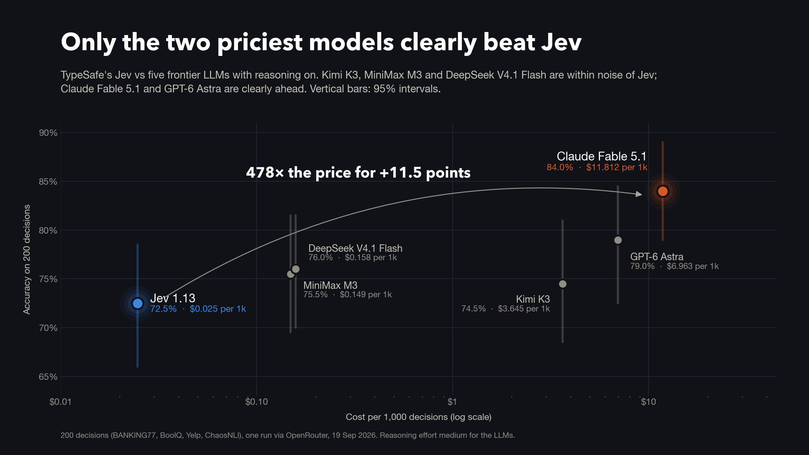

# Jev vs frontier LLMs on typed decisions

A small, reproducible benchmark of TypeSafe's **Jev 1.13**, a "System One" decision model, against five frontier LLMs with reasoning enabled: **Claude Fable 5.1, GPT-6 Astra, Kimi K3, MiniMax M3 and DeepSeek V4.1 Flash**. Every model got the same 200 decisions from four public datasets. Everything was called through OpenRouter on 19 September 2026, and the whole run cost $4.83.



## Results

| Model | Accuracy (95% CI) | Calibration error (ECE) | Median / p95 latency | $ per 1,000 decisions | Reasoning tokens (mean) |
|---|---|---|---|---|---|
| Jev 1.13 | 72.5% (66.0-78.5) | 0.161 | **0.43 / 0.55 s** | **$0.025** | - |
| Claude Fable 5.1 | **84.0%** (79.0-89.0) | **0.064** | 4.27 / 6.58 s | $11.81 | 2 |
| GPT-6 Astra | 79.0% (72.5-84.5) | 0.119 | 2.22 / 4.98 s | $6.96 | 20 |
| Kimi K3 | 74.5% (68.5-81.0) | 0.119 | 6.28 / 14.52 s | $3.65 | 89 |
| MiniMax M3 | 75.5% (69.5-81.5) | 0.112 | 1.02 / 1.87 s | $0.149 | 0 |
| DeepSeek V4.1 Flash | 76.0% (70.0-81.5) | 0.138 | 4.08 / 23.50 s | $0.158 | 236 |

- **Paired against Jev on the same items**, only Claude Fable 5.1 (+11.5 points, 95% CI +7 to +17) and GPT-6 Astra (+6.5, +2 to +11) are clearly ahead. Kimi, MiniMax and DeepSeek are within noise.
- **Per task:**

  | Task | Jev | Others |
  |---|---|---|
  | Yes/no | 94%, AUROC 0.970 | AUROC 0.942-0.986; Jev ties |
  | Routing | 76% | 80-88% |
  | Rating | 62%, MAE 0.42 stars | 60-74% |
  | Ambiguity | 58% | 54-80% |

- **Agreement with 100 human annotators (ChaosNLI):** Claude Fable 5.1's probabilities are far closer to the human label split than any other model's (Jensen-Shannon divergence 0.043; next best MiniMax 0.107; Jev 0.149). A uniform one-third guess scores 0.127, which beats Jev, GPT-6 Astra and DeepSeek. See `results/fig2_human_agreement.png`.
- **The frontier models barely reasoned** on these short questions, even at `reasoning.effort = medium`.
- **Cascade** (computed from the same logs, threshold chosen in-sample): taking Jev's answer when its top probability is at least 0.9 and escalating the rest to Claude Fable 5.1 gives 82.5% accuracy at $4.41 per 1,000 decisions, 37% of Fable's cost.

## Tasks (50 items each, seed 20260919)

| Task | Source | Jev question type |
|---|---|---|
| Routing | BANKING77 test set, all 77 intents plus "other" | `choice` |
| Yes/no | BoolQ validation set, 25 yes / 25 no | `noul` |
| Rating | Yelp Review Full test set, 10 per star, reviews of at most 1,500 characters | `score` (5 levels) |
| Ambiguity | ChaosNLI (MNLI subset, 100 labels per item) | `choice` (3 options) |

## Method

- **Same prompt for every model:** the same input, instructions and options. Jev gets them as native typed questions via `POST https://openrouter.ai/api/alpha/decisions`.
- **LLM answers:** the LLMs return strict JSON-schema output with a probability for every option. For the 78-option routing task they return their answer plus one confidence instead, because Anthropic's API rejects the larger schema ("compiled grammar is too large").
- **Confidence** is the probability a model gave its own answer. For Jev that is the top value of `probabilities`, not its `confidence` field, which TypeSafe documents as a summary statistic rather than a probability.
- **Reasoning:** the LLMs run with `reasoning.effort = medium` and no temperature override.
- **Pinned hosts:** each model is pinned to one host with `allow_fallbacks: false`:
  - Anthropic and OpenAI: first-party
  - Kimi K3: Moonshot AI
  - MiniMax M3: Together
  - DeepSeek V4.1 Flash: DeepInfra fp8
- **Latency** is wall time per call from India, network included. For each item, all arms run concurrently.

## Reproduce

```bash
pip install -r requirements.txt
echo 'OPENROUTER_API_KEY=sk-or-...' > .env && chmod 600 .env

python bench.py sample          # rebuild the 200 items from the public sources, verified against the manifest
python bench.py run --per-task 5 --effort medium --log pilot   # optional pilot, about $0.45
python bench.py run --effort medium                             # full run, about $4.50 (stops at $12 total)
python analyze.py               # tables + results/summary.json
python charts.py                # results/fig*.png
```

`analyze.py` and `charts.py` work on the published logs as they are, without an API key or the dataset text.

## What's in `results/`

- `calls.jsonl`: every scored call (1,200 plus one dropped connection that was retried). Each record has the parsed probabilities, wall time, billed cost, token usage, host and the raw response.
- `items_manifest.json`: item ids, tasks, options, correct answers, the ChaosNLI human label split, and SHA-256 hashes of each item's input and instructions.
- `summary.json`, `fig*.png`: the metrics and charts above.
- `extra/`: the pilot, aborted and probe runs. They count toward the $4.83 but not toward any result.

**Not included:** the dataset text itself. The Yelp reviews are under Yelp's own licence and ChaosNLI states none, so `bench.py sample` downloads the items from the original sources, and the manifest hashes let you confirm you have the same ones. For the same reason, the models' reasoning summaries in the raw responses are replaced by a placeholder; token counts are kept.

## Caveats

- 50 items per task: per-task differences under about 10 points are within noise.
- One run, one region, through OpenRouter.
- Jev is in early access. This is build `jev-1.13-20260917`.
- The ambiguity items were selected (by ChaosNLI) for human disagreement, which is part of why calibration here is worse than in [Omar Mujahid's jev-decision-bench](https://github.com/OmarMujahid/jev-decision-bench) (49 tasks vs GPT-5.6 Luna), the most thorough earlier comparison.

## Sources

- TypeSafe, [Introducing System One models and Jev](https://typesafe.ai/blog/introducing-system-one-models-and-jev); [API docs](https://docs.typesafe.ai/api)
- Casanueva et al., 2020, BANKING77 (CC BY 4.0)
- Clark et al., 2019, BoolQ (CC BY-SA 3.0)
- Zhang et al., 2015, Yelp Review Full
- Nie et al., 2020, *What Can We Learn from Collective Human Opinions on Natural Language Inference Data?* (ChaosNLI)

## License

Code: MIT (see `LICENSE`). Results and charts: CC BY 4.0.
